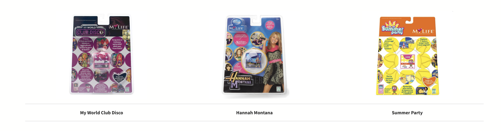

# My Life by Giochi Preziosi

## What is My Life?
My Life is a handheld cartridge based console released by Giochi Preziosi.

Released in Italy in 2007, the My Life was a huge success for Giochi Preziosi. The handheld revolved around the creation of your own avatar which would then be the centrepiece of the device. The handheld feature a virtual world, a varieties of built in mini games, tamagotchi-like responsibilities, dressing room, etc.

## Cartridges
The console has two types of cartridges: the magic keys and the expansion cartridges.

### [Magic Keys](MagicKeys)
Although the magic keys insert in the cartridge slot, *they seem to only unlock digital assets already present in the handheld, therefore not containing any data.* 

### Expansion cartridges
The expansion cartridges, on the other hand, are full blown game cartridges with an extra connector to allow special magic keys, that only work with each expansion cartridge, to be connected. Only 3 of these expansion cartridges were ever made: My World Club Disco, Hannah Montana and Summer Party.

## Functions
- **Game controller:** 4-way directional pad for moving the character and navigating the MENU.
- **Buttons A and B:** buttons used to interact with characters, confirm, cancel, or return to the previous function.
- **Heart Button:** button to access the game MENU.
- **ON/OFF Button:** located on the back, used to turn the console on and off.
- **Cartridge compartment:** located at the back of the console, used to insert GIFT CARDS.
- **Infrared port:** its activation is linked to interacting with the My Life post office clerk. Consoles must face each other and be at a maximum distance of 1 m.
- **Batteries:** 3 × 1.5 V AAA

## About this repository
The purpose of this repository is to collect and preserve as much information as possible about a niche, nearly forgotten console. All research is conducted for informational and educational purposes only.
Collaborations are welcome.

## Sources
- http://videogamekraken.com/my-life-by-giochi-preziosi
- https://manualmachine.com/giochipreziosi/consolemylife/7120280-user-manual/
